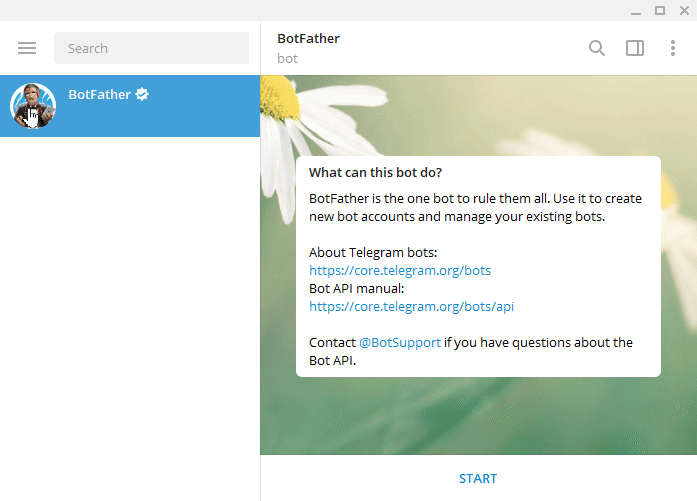

# BUILD_BOT WORKSHOP

Develop a OpenAI powered Telegram Bot using Python.

---
## Installing Packages

We use python-telegram-bot package to build a bot.

It can be installed by executing following command on terminal.
```
pip install python-telegram-bot
```


Official openai package is used to connect with OpenAI API.

It can be installed by executing following command on terminal.
```
pip install openai
```

---

## Creating a bot



---

## Obtaining OpenAI API Key

We can get a API key for OpenAI from following link:
[https://platform.openai.com/account/api-keys](https://platform.openai.com/account/api-keys)  

---

## References

You can learn more about python-telegram-bot and openai api with examples from following links.

#### Python Telegram Bot Wiki:
[https://github.com/python-telegram-bot/python-telegram-bot/wiki](https://github.com/python-telegram-bot/python-telegram-bot/wiki#ptb-resources)

#### OpenAI API Reference: 
[https://platform.openai.com/docs/api-reference/](https://platform.openai.com/docs/api-reference/)
